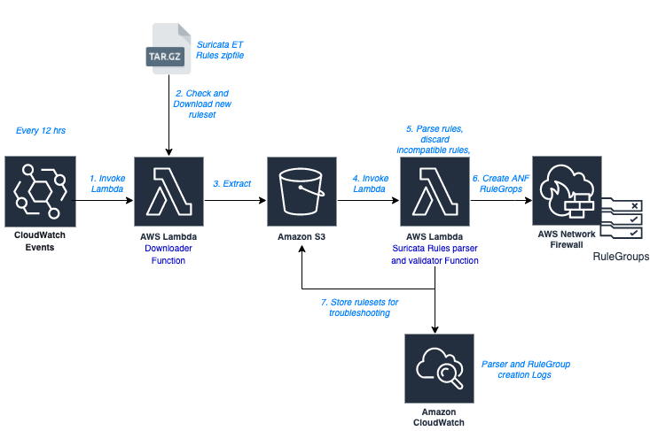
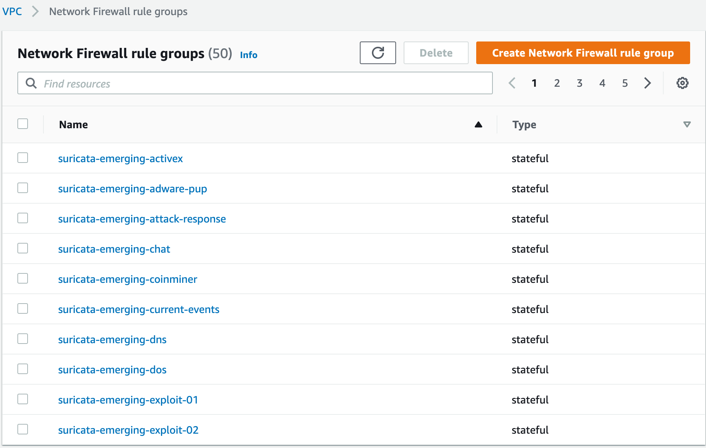
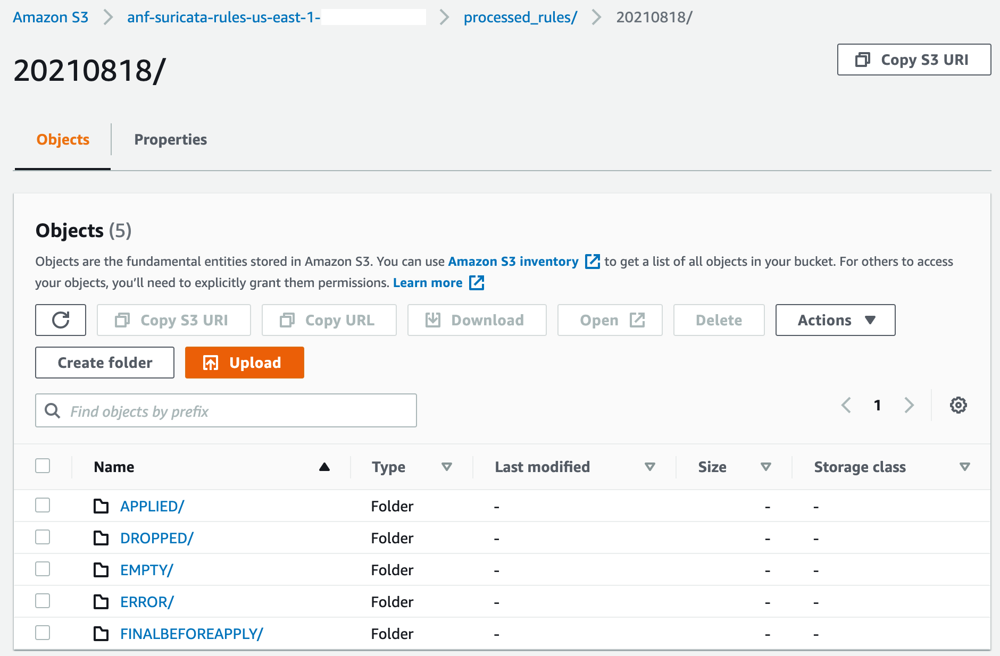

# Ingest Proofpoint emerging threat rule sets into AWS Network Firewall Rulegroups

The repository provides automation that is necessary to parse the [Proofpoints emerging threats rule sets](https://rules.emergingthreats.net/open/suricata/rules/) to AWS Network Firewall rulegroups. 

## Prerequisites

1. An AWS account with AWS Network Firewall deployed and credentials to create the necessary resources.
2. Install AWS Command Line Interface (CLI) and AWS SAM CLI.
3. Increase the service limit for Number of Network firewall RuleGroups per account from the defaults.

## Note
The solution creates approximately 60 rulegroups from Proof Point's emerging threats open rule set. Incorporate only the rulegroups that fits your use case in the firewall policy. 

## Solution Components

  
Figure 1 : Suricata Rules Ingestion Workflow

Our solution will deploy the following components

* **S3 Bucket** : Stores Pre and Post processed Suricata rule files.
* **Lambda Function - ANFSuricataRulesDownloader** : Downloads, extracts Suricata Ruleset from [https://rules.emergingthreats.net/open/suricata-{{VERSION}}/emerging.rules.tar.gz](https://rules.emergingthreats.net/open/suricata-%7B%7BVERSION%7D%7D/emerging.rules.tar.gz) into the S3 bucket. Triggered on a Cloudwatch Scheduled Event every 6 hrs (can be changed)
* **Lambda Function - ANFSuricataRulesProcessor** : Parses Suricata Rules file, drops invalid rules and creates final rules file. Based on the # of rules, defines rulegroup capacity and create rulesgroups. If rulegroup already exists, it updates the existing rulegroup with updated rules. Triggered on each file extracted by the downloader script (File named emerging-*.rules are processed)
* **Lambda Function - ANFSuricataRuleGroupSummaryReport** : Provides a summary report of all imported Suricata rulegroups and their capacity. Triggered manually when needed.
* **SSM Parameter - SuricataRulesetUpdateCheck** : Stores the current Suricata ruleset version from https://rules.emergingthreats.net/version.txt.
* Additional associated resources such as IAM Roles, CW Events.

## Deployment steps

The  solution is developed as a AWS Serverless Application Model (AWS SAM) package. The AWS Serverless Application Model is an open-source framework that you can use to build [serverless applications](https://aws.amazon.com/serverless/) on AWS. The code for our solution can be found in code [GitHub repository](https://gitlab.aws.dev/technical-delivery-kits/networking-content-delivery/network-firewall-deployment/-/tree/master/emerging-threats-parser). First, clone the application code to your local machine, then deploy it to your AWS account:

1. Run the following command in a terminal window on your local machine
```
git clone https://github.com/aws-samples/aws-network-firewall-rulegroups-with-proofpoints-emerging-threats-open-ruleset
```
2. Change directory into the root of the git repository folder
3. Authenticate the terminal session to AWS account via AWS CLI commands. Refer [Configuring the AWS CLI](https://docs.aws.amazon.com/cli/latest/userguide/cli-chap-configure.html)
4. Deploy the solution to your AWS account using the following AWS SAM CLI command:
```
sam build
sam deploy --guided
```
Most parameters can be left default and can be modified later from the lambda environment variables. Depending upon your environment you may change below parameters:

* **DNSSERVERS:** List of your local DNS servers or VPC provided DNS servers
* **HTTPSERVERS:** List of HTTP endpoints within your environment or you may specify the complete VPC CIDR range
* **DownloaderSchedule:** Default downloader schedule is to run every 6 hrs, however the rule groups are updated only if there is an updated ruleset version. 

**Sample screenshots**

```
bash-3.2$ sam build
Building codeuri: <truncated>
    Running PythonPipBuilder:ResolveDependencies
    Running PythonPipBuilder:CopySource
    
    Build Succeeded
    
    Built Artifacts  : .aws-sam/build
    Built Template   : .aws-sam/build/template.yaml
    
    Commands you can use next
    =========================
    [*] Invoke Function: sam local invoke
    [*] Deploy: sam deploy --guided
    
    
    bash-3.2$ sam deploy --guided
    
    Configuring SAM deploy
    ======================
    
        Looking for config file [samconfig.toml] :  Found
        Reading default arguments  :  Success
    
        Setting default arguments for 'sam deploy'
        =========================================
        Stack Name [anf-suricata-parser]:
        AWS Region [us-east-1]:
        Parameter SuricataRulesetVersion [6.0.2]:
        Parameter SuricataRulesetDownloadUrl [https://rules.emergingthreats.net/open/suricata-VERSION/emerging.rules.tar.gz]:
        Parameter SuricataUpdateCheckUrl [https://rules.emergingthreats.net/version.txt]:
        Parameter DNSSERVERS [[4.4.4.4]]:
        Parameter HTTPSERVERS [[10.0.0.0/16]]:
        Parameter HTTPPORTS [[80,443,8080]]:
        Parameter DownloaderSchedule [rate(6 hours)]:
        #Shows you resources changes to be deployed and require a 'Y' to initiate deploy
        Confirm changes before deploy [Y/n]: Y
        #SAM needs permission to be able to create roles to connect to the resources in your template
        Allow SAM CLI IAM role creation [Y/n]: Y
        Save arguments to configuration file [Y/n]: Y
        SAM configuration file [samconfig.toml]: Y
        SAM configuration environment [default]:
```

5. Validate the CloudFormation stack is deployed successfully by logging into the AWS console. The solution is triggered at a 6hour interval by default. To trigger it manually, create a test event by navigating to lambda service in the console.  
6. Select **ANFSuricataRulesDownloader** function. Click on Test button on the drop-down and choose **Configure test events**. Select hello-world template and save as “test”. Click the Test icon to start the lambda job. This will trigger the workflow described in Figure 1.
7. The ANFSuricataRulesProcessor will create 50+ rule groups under normal circumstances. The rule groups are ready to be associated to your AWS Network Firewall policy based on your specific requirements. 
8. To do this, navigate to the VPC service in AWS console. Select Network Firewall Policy on the left. Select the appropriate rule groups that are required and add them to the policy. Click Save. An example screenshot of different rule groups created via our solution is shown below in Figure 2.  



Figure 2 : AWS Network Firewall Rule groups based on Emerging Threats

## Convert IDS to IPS ruleset
All rulesets released by Proofpoint Emerging threats are based on IDS and by default our solution creates  IDS rulegroups. These rulegroups have an action=“alert” while IPS rulegroups will have an action=“drop”. We also provide you with a helper lambda function that can create IPS rulegroups based out the default IDS rulegroups that are created. In order to create IPS rulegroups: add comma separated list of IDS rulegroup names to ConvertRuleGroupIDStoIPS in the SSM Parameter.  

Example: If the value of SSM Parameter **ConvertRuleGroupIDStoIPS** is set to “suricata-emerging-dns,suricata-emerging-dos”, then two additional ips rulegroups ips-suricata-emerging-dns,ips-suricata-emerging-dos on next scheduled run. These IPS rulegroups can be added to firewall policy similar to IDS rulegroups. Please ensure to test and validate with IDS rulegroups before applying IPS rulegroups to firewall policy. 

The SSM Parameter value can be updated at any time after first run.

## Troubleshooting

For troubleshooting any errors encountered while creating the rulegroups, check for any errors in Cloudwatch logs for the respective lambda jobs. 

The **ANFSuricataRulesProcessor** lambda saves the rulesets under “Applied”, “Dropped” and respective folders in the s3 bucket as shown in figure 3. This information can also be used for troubleshooting. 

Figure 3 : S3 bucket with rulesets actions

## Cleanup

To avoid ongoing charges, delete the resources created. Go to AWS Management console : 

* Identify the s3 bucket created as part of the cloudformation stack and empty the bucket. 
* Once the bucket is emptied, identity and delete the cloudformation stack created by the deployment. 
* Identify and delete all AWS Network Firewall rulegroups starting with “suricata-emerging” name prefix. 


## Code Owners

* Lakshmikanth Pandre
* Shiva Vaidyanathan

## Security

See [CONTRIBUTING](CONTRIBUTING.md#security-issue-notifications) for more information.

## License

This library is licensed under the MIT-0 License. See the LICENSE file.

